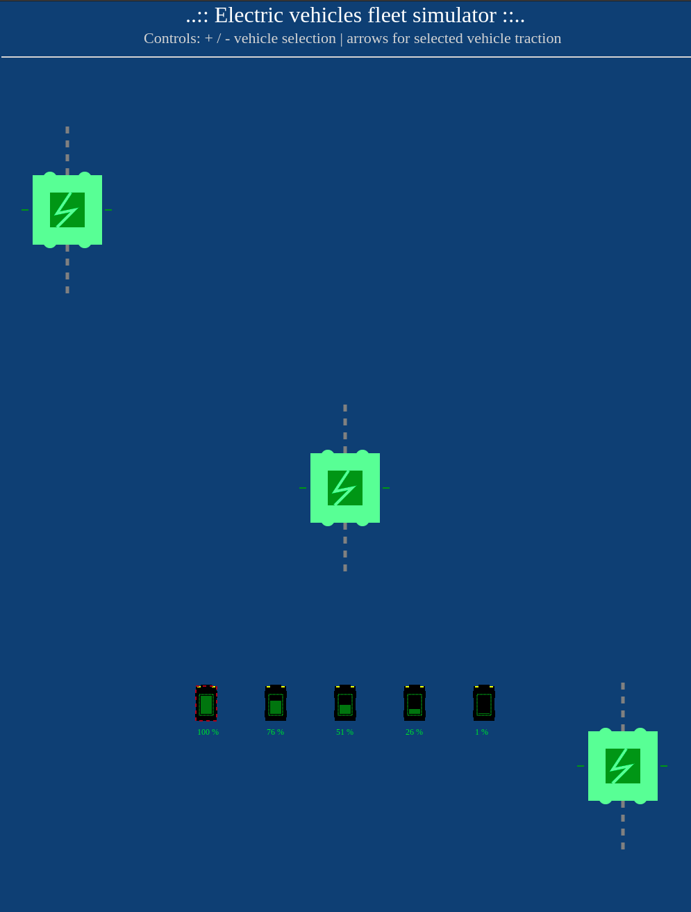

# Electric Vehicles Fleet Simulator

Web based electric vehicles fleet simulator (UI prototype for EV chargers experiments)

### Features - you can (in pre-alpha version)
- drive mini EV car emulator actor (use arrows keys on keyboard)
- switch beetwen cars in fleet (+ / - keys on keyboard)
- EV car discharging when is used
- EV charger react with car

#### How to run

```bash
$ git clone https://github.com/bieli/electric-vehicles-fleet-simulator.git
$ cd electric-vehicles-fleet-simulator/src
$ google-chrome index.html
```

#### Screenshot - pre-alpha version


