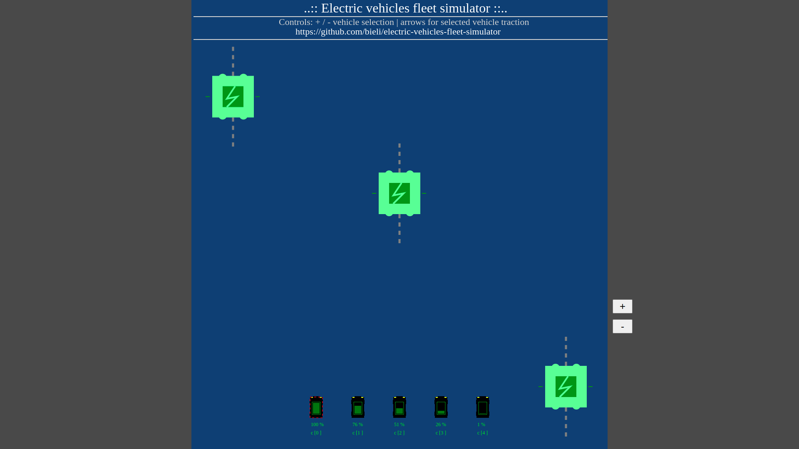

# Electric Vehicles Fleet Simulator

Web based electric vehicles fleet simulator (UI prototype for EV chargers experiments).

This project motivation is discovering new `automotive` domain.

This subject is strongly connected to my passion: `Industrial Internet of Things`.


### Features - you can (in pre-alpha version)
- drive mini EV car emulator actor (use arrows keys on keyboard)
- switch beetwen cars in fleet (+ / - keys on keyboard)
- EV car discharging when is used
- EV charger react with car
- EV charging when is on station

#### How to run

```bash
$ git clone https://github.com/bieli/electric-vehicles-fleet-simulator.git
$ cd electric-vehicles-fleet-simulator/src
$ google-chrome index.html
```

#### TODO
- [x] use pure JavaScript to delivery simulator basic UI for web browser GUI
- [x] push pre-alpha version on github
- [x] add code formatter for JavaScript
- [x] fix problem with car charging only on 3rd station
- [ ] add WebSockets client and server
- [ ] add WebSockets impl. for sending statuses about EV cars activity as real-time data streams
- [ ] add backend for processing data streams with metrics from EV cars fleet
- [ ] add analytics dashboard with interesting EV cars fleet metrics
- [ ] use Deep Learing to a few creative features in case of simulation similar to real cars behaviuors
- [ ] add real maps from city plans
- [ ] add autonomous car feature

#### Screenshot - pre-alpha version



### Requirements for development
- node version manager (nvm)
- node lts version
- npm
- make

